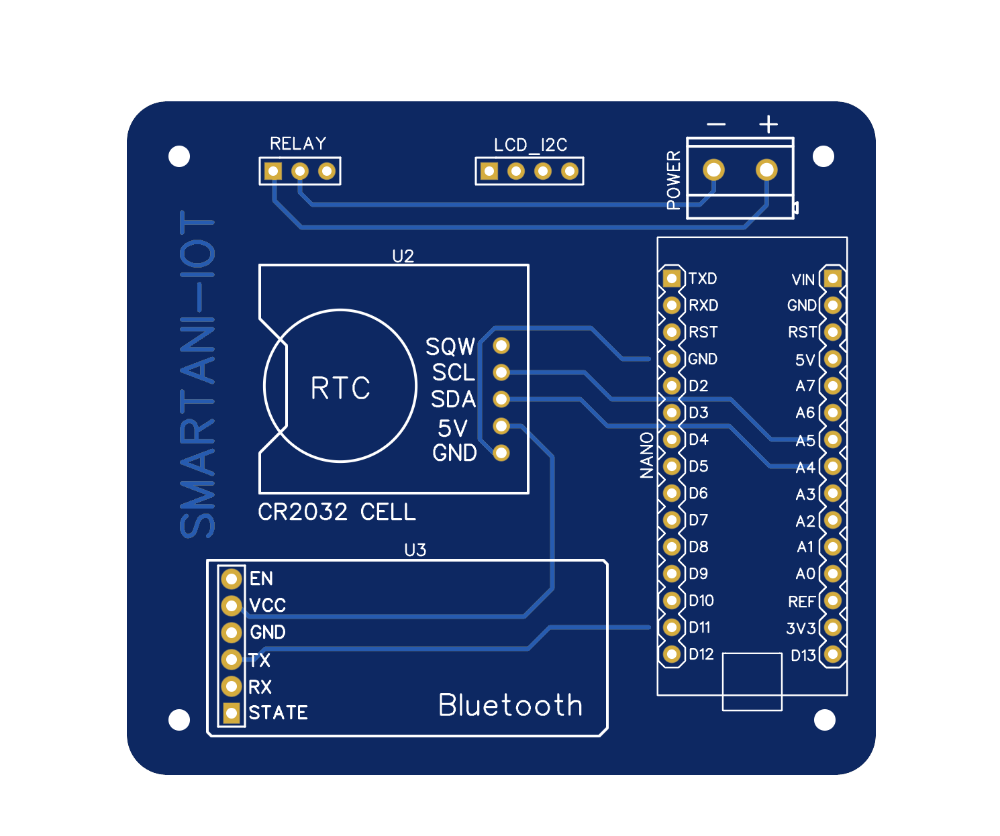
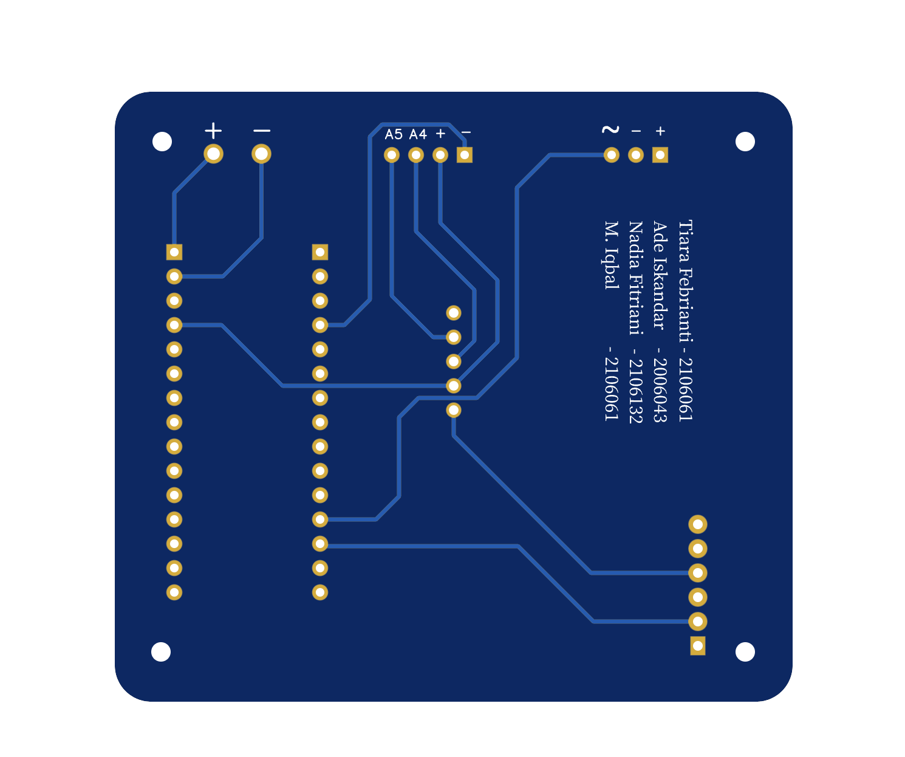

# smartani-iot

part of the IoT course assignment Institut Teknologi Garut by TANI team
```
T - Tiara
A - Ade
N - Nadia
I - Iqbal
```
## requirement

-   `SoftwareSerial`

## bluetooth command

-   ex: turn on relay (10 second)

```
timer:set:10000
```

-   ex: turn of relay

```
timer:off
```

### thumbnail project



